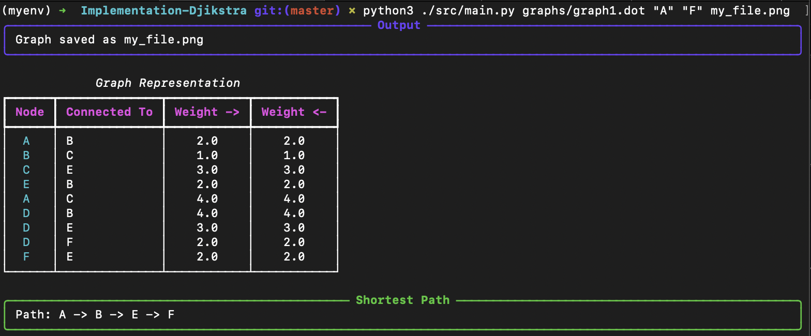
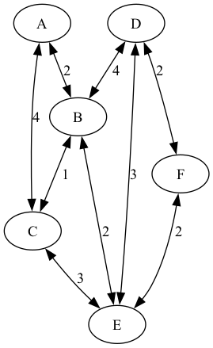
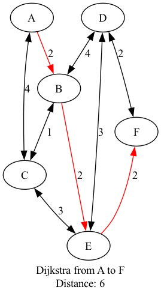

# The dijkstra algorithm

## Initial setup

```shell
python3 -m venv myenv
source myenv/bin/activate
pip install -r requirements.txt
```

## Usage

```shell
Usage: python3 src/main.py <graph_path> <node_start> <node_end> [output_file]
```

## For example

```shell
python3 src/main.py graphs/graph1.dot A F examples/graph1_solved.png
```

In this case, the program will find the shortest path from node A to node D in the graph1.dot file.
It will create a `graph.png` file with the graph and the shortest path, in red.

### CLI output



### Graph1 original



### Graph1 solved



## Team members

- [Raquel Magdalena Ochoa Martínez](https://github.com/raqueochoam)
- [Santiago Perez Ochoa](https://github.com/santi1025)
- [Niels Ouvrard](https://github.com/NielsOuvrard).
